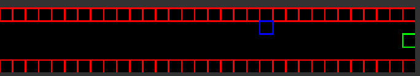
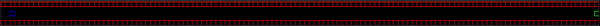
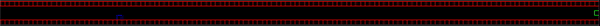
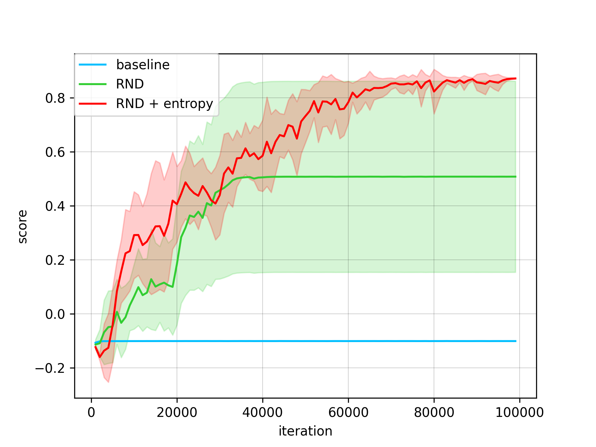
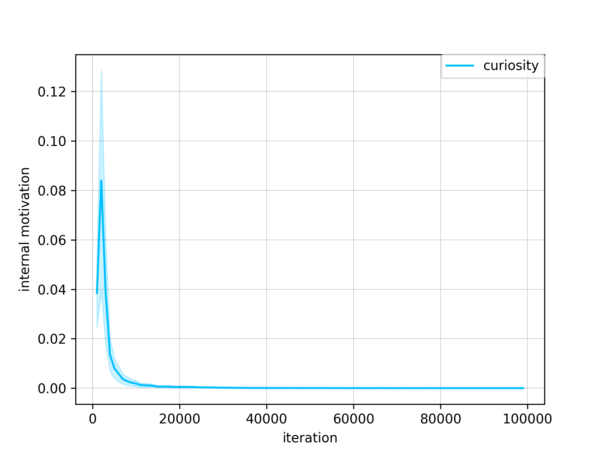
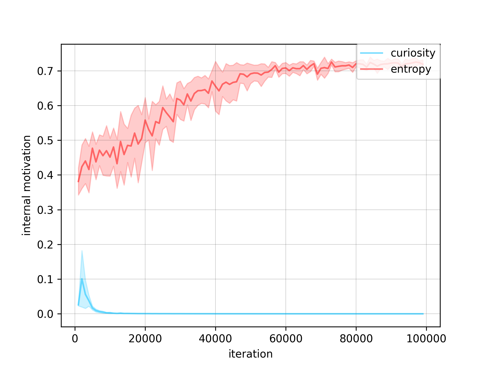

# intrinsics motivation experiments

# 0 testing environment

**random network distillation**

**random network distillation and entropy motivation**

- the baseline agent is not able to solve environment
- the random network distillation can solve problem in arround 50% of cases
- random network distillation and entropy motivation solve problem in 100% cases 

curiosity motivation for RND drop too quickly, and is not working as learning signal anymore

combination of curiosity and entropy can helps to learn

# dependences
cmake python3 python3-pip

**basic python libs**
pip3 install numpy matplotlib torch torchviz pillow opencv-python networkx

**environments**
pip3 install  gym pybullet pybulletgym 'gym[atari]' 'gym[box2d]' gym-super-mario-bros gym_2048