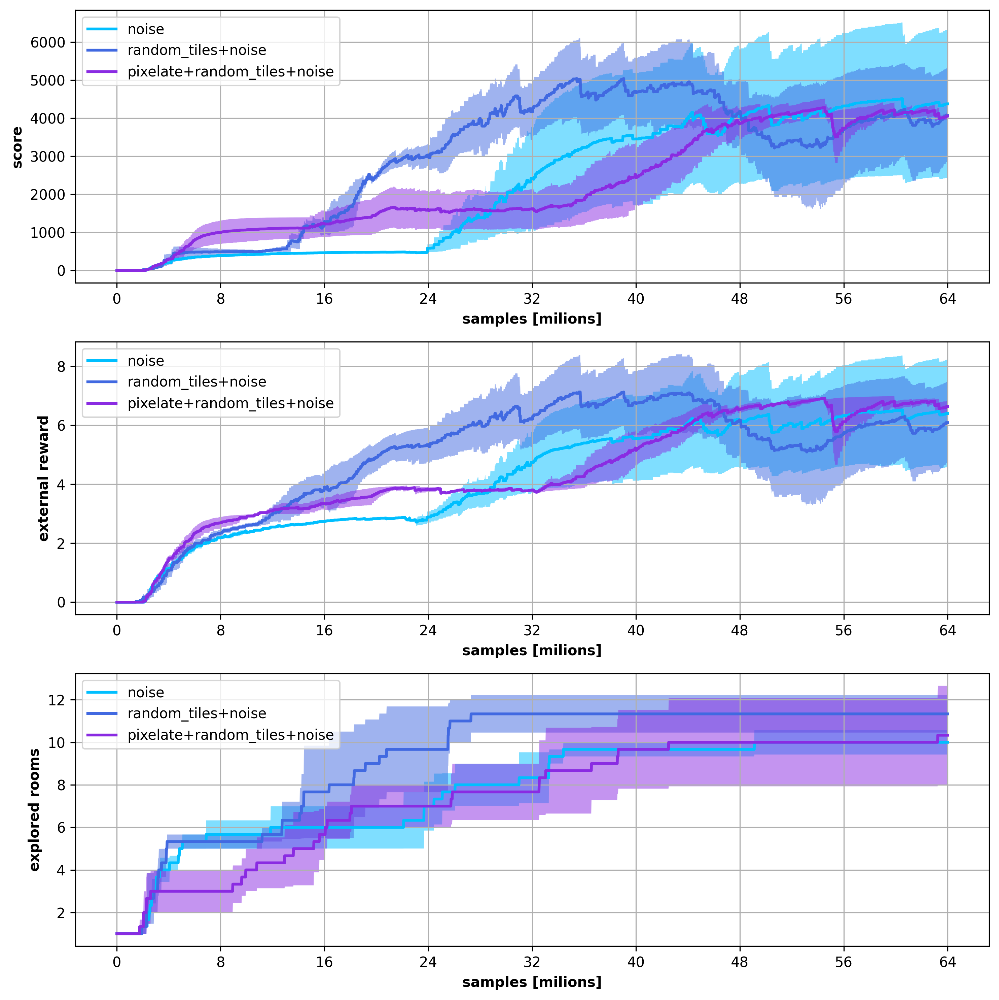

# results for cndsa_0_1_2

## notes
augmentations experiments 

intrinsic reward scaling : {0.25, 0.5, 1.0}

augmentations 0 : [noise]

augmentations 1 : [random_tiles, noise]

augmentations 2 : [pixelate, random_tiles, noise]

# input files and configs

**noise**

* run 0

* result: [../experiments/atari_hard/montezuma_revenge/models/ppo_cndsa_0_0/result/result.log](../../../experiments/atari_hard/montezuma_revenge/models/ppo_cndsa_0_0/result/result.log)

* config: [../experiments/atari_hard/montezuma_revenge/models/ppo_cndsa_0_0/src/config.py](../../../experiments/atari_hard/montezuma_revenge/models/ppo_cndsa_0_0/src/config.py)

* run 1

* result: [../experiments/atari_hard/montezuma_revenge/models/ppo_cndsa_0_1/result/result.log](../../../experiments/atari_hard/montezuma_revenge/models/ppo_cndsa_0_1/result/result.log)

* config: [../experiments/atari_hard/montezuma_revenge/models/ppo_cndsa_0_1/src/config.py](../../../experiments/atari_hard/montezuma_revenge/models/ppo_cndsa_0_1/src/config.py)

* run 2

* result: [../experiments/atari_hard/montezuma_revenge/models/ppo_cndsa_0_2/result/result.log](../../../experiments/atari_hard/montezuma_revenge/models/ppo_cndsa_0_2/result/result.log)

* config: [../experiments/atari_hard/montezuma_revenge/models/ppo_cndsa_0_2/src/config.py](../../../experiments/atari_hard/montezuma_revenge/models/ppo_cndsa_0_2/src/config.py)

**random_tiles+noise**

* run 0

* result: [../experiments/atari_hard/montezuma_revenge/models/ppo_cndsa_1_0/result/result.log](../../../experiments/atari_hard/montezuma_revenge/models/ppo_cndsa_1_0/result/result.log)

* config: [../experiments/atari_hard/montezuma_revenge/models/ppo_cndsa_1_0/src/config.py](../../../experiments/atari_hard/montezuma_revenge/models/ppo_cndsa_1_0/src/config.py)

* run 1

* result: [../experiments/atari_hard/montezuma_revenge/models/ppo_cndsa_1_1/result/result.log](../../../experiments/atari_hard/montezuma_revenge/models/ppo_cndsa_1_1/result/result.log)

* config: [../experiments/atari_hard/montezuma_revenge/models/ppo_cndsa_1_1/src/config.py](../../../experiments/atari_hard/montezuma_revenge/models/ppo_cndsa_1_1/src/config.py)

* run 2

* result: [../experiments/atari_hard/montezuma_revenge/models/ppo_cndsa_1_2/result/result.log](../../../experiments/atari_hard/montezuma_revenge/models/ppo_cndsa_1_2/result/result.log)

* config: [../experiments/atari_hard/montezuma_revenge/models/ppo_cndsa_1_2/src/config.py](../../../experiments/atari_hard/montezuma_revenge/models/ppo_cndsa_1_2/src/config.py)

**pixelate+random_tiles+noise**

* run 0

* result: [../experiments/atari_hard/montezuma_revenge/models/ppo_cndsa_2_0/result/result.log](../../../experiments/atari_hard/montezuma_revenge/models/ppo_cndsa_2_0/result/result.log)

* config: [../experiments/atari_hard/montezuma_revenge/models/ppo_cndsa_2_0/src/config.py](../../../experiments/atari_hard/montezuma_revenge/models/ppo_cndsa_2_0/src/config.py)

* run 1

* result: [../experiments/atari_hard/montezuma_revenge/models/ppo_cndsa_2_1/result/result.log](../../../experiments/atari_hard/montezuma_revenge/models/ppo_cndsa_2_1/result/result.log)

* config: [../experiments/atari_hard/montezuma_revenge/models/ppo_cndsa_2_1/src/config.py](../../../experiments/atari_hard/montezuma_revenge/models/ppo_cndsa_2_1/src/config.py)

* run 2

* result: [../experiments/atari_hard/montezuma_revenge/models/ppo_cndsa_2_2/result/result.log](../../../experiments/atari_hard/montezuma_revenge/models/ppo_cndsa_2_2/result/result.log)

* config: [../experiments/atari_hard/montezuma_revenge/models/ppo_cndsa_2_2/src/config.py](../../../experiments/atari_hard/montezuma_revenge/models/ppo_cndsa_2_2/src/config.py)

# results 

## result in fig : cndsa_0_1_2.png

