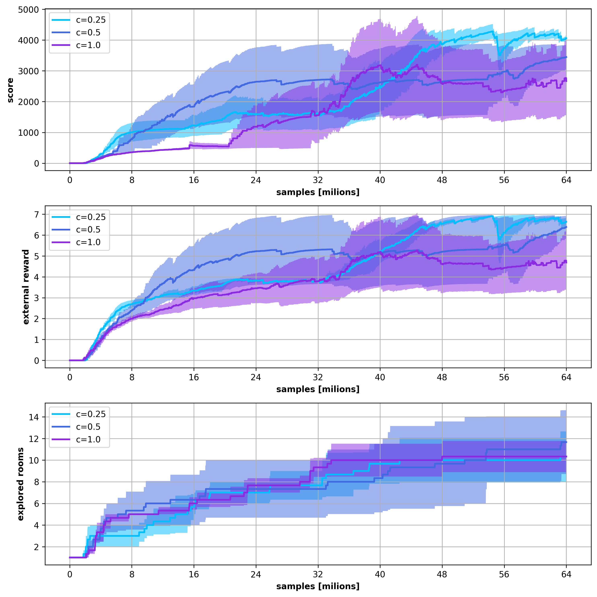

# results for cndsa_2_3_4

## notes
intrinsic reward scaling experiments 

intrinsic reward scaling : {0.25, 0.5, 1.0}

augmentations : [pixelate, random_tiles, noise]

# input files and configs

**c=0.25**

* run 0

* result: [../experiments/atari_hard/montezuma_revenge/models/ppo_cndsa_2_0/result/result.log](../../../experiments/atari_hard/montezuma_revenge/models/ppo_cndsa_2_0/result/result.log)

* config: [../experiments/atari_hard/montezuma_revenge/models/ppo_cndsa_2_0/src/config.py](../../../experiments/atari_hard/montezuma_revenge/models/ppo_cndsa_2_0/src/config.py)

* run 1

* result: [../experiments/atari_hard/montezuma_revenge/models/ppo_cndsa_2_1/result/result.log](../../../experiments/atari_hard/montezuma_revenge/models/ppo_cndsa_2_1/result/result.log)

* config: [../experiments/atari_hard/montezuma_revenge/models/ppo_cndsa_2_1/src/config.py](../../../experiments/atari_hard/montezuma_revenge/models/ppo_cndsa_2_1/src/config.py)

* run 2

* result: [../experiments/atari_hard/montezuma_revenge/models/ppo_cndsa_2_2/result/result.log](../../../experiments/atari_hard/montezuma_revenge/models/ppo_cndsa_2_2/result/result.log)

* config: [../experiments/atari_hard/montezuma_revenge/models/ppo_cndsa_2_2/src/config.py](../../../experiments/atari_hard/montezuma_revenge/models/ppo_cndsa_2_2/src/config.py)

**c=0.5**

* run 0

* result: [../experiments/atari_hard/montezuma_revenge/models/ppo_cndsa_3_0/result/result.log](../../../experiments/atari_hard/montezuma_revenge/models/ppo_cndsa_3_0/result/result.log)

* config: [../experiments/atari_hard/montezuma_revenge/models/ppo_cndsa_3_0/src/config.py](../../../experiments/atari_hard/montezuma_revenge/models/ppo_cndsa_3_0/src/config.py)

* run 1

* result: [../experiments/atari_hard/montezuma_revenge/models/ppo_cndsa_3_1/result/result.log](../../../experiments/atari_hard/montezuma_revenge/models/ppo_cndsa_3_1/result/result.log)

* config: [../experiments/atari_hard/montezuma_revenge/models/ppo_cndsa_3_1/src/config.py](../../../experiments/atari_hard/montezuma_revenge/models/ppo_cndsa_3_1/src/config.py)

* run 2

* result: [../experiments/atari_hard/montezuma_revenge/models/ppo_cndsa_3_2/result/result.log](../../../experiments/atari_hard/montezuma_revenge/models/ppo_cndsa_3_2/result/result.log)

* config: [../experiments/atari_hard/montezuma_revenge/models/ppo_cndsa_3_2/src/config.py](../../../experiments/atari_hard/montezuma_revenge/models/ppo_cndsa_3_2/src/config.py)

**c=1.0**

* run 0

* result: [../experiments/atari_hard/montezuma_revenge/models/ppo_cndsa_4_0/result/result.log](../../../experiments/atari_hard/montezuma_revenge/models/ppo_cndsa_4_0/result/result.log)

* config: [../experiments/atari_hard/montezuma_revenge/models/ppo_cndsa_4_0/src/config.py](../../../experiments/atari_hard/montezuma_revenge/models/ppo_cndsa_4_0/src/config.py)

* run 1

* result: [../experiments/atari_hard/montezuma_revenge/models/ppo_cndsa_4_1/result/result.log](../../../experiments/atari_hard/montezuma_revenge/models/ppo_cndsa_4_1/result/result.log)

* config: [../experiments/atari_hard/montezuma_revenge/models/ppo_cndsa_4_1/src/config.py](../../../experiments/atari_hard/montezuma_revenge/models/ppo_cndsa_4_1/src/config.py)

* run 2

* result: [../experiments/atari_hard/montezuma_revenge/models/ppo_cndsa_4_2/result/result.log](../../../experiments/atari_hard/montezuma_revenge/models/ppo_cndsa_4_2/result/result.log)

* config: [../experiments/atari_hard/montezuma_revenge/models/ppo_cndsa_4_2/src/config.py](../../../experiments/atari_hard/montezuma_revenge/models/ppo_cndsa_4_2/src/config.py)

# results 

## result in fig : cndsa_2_3_4.png

