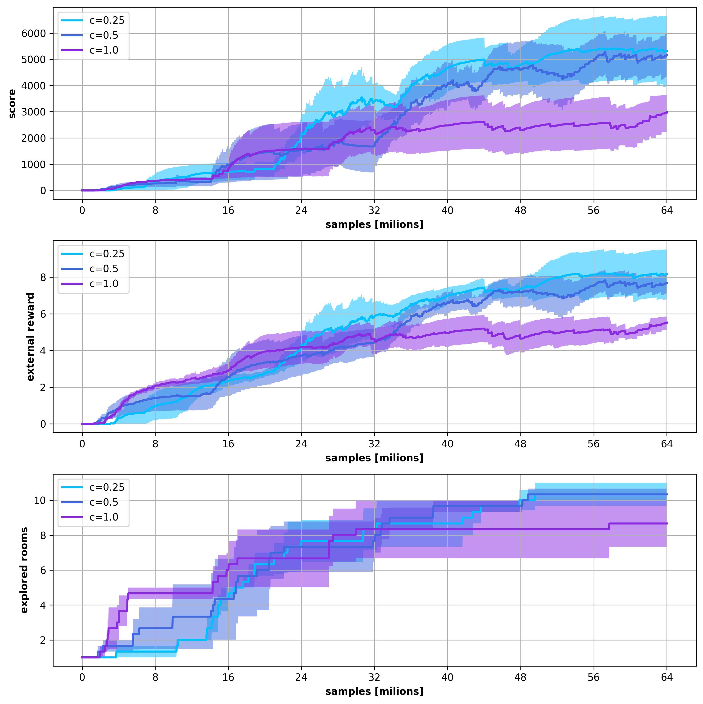

# results for cndsa_5_6_7

## notes
agent with advantages variance normalisation

intrinsic reward scaling : {0.25, 0.5, 1.0}

augmentations : [pixelate, random_tiles, noise]

# input files and configs

**c=0.25**

* run 0

* result: [../experiments/atari_hard/montezuma_revenge/models/ppo_cndsa_5_0/result/result.log](../../../experiments/atari_hard/montezuma_revenge/models/ppo_cndsa_5_0/result/result.log)

* config: [../experiments/atari_hard/montezuma_revenge/models/ppo_cndsa_5_0/src/config.py](../../../experiments/atari_hard/montezuma_revenge/models/ppo_cndsa_5_0/src/config.py)

* run 1

* result: [../experiments/atari_hard/montezuma_revenge/models/ppo_cndsa_5_1/result/result.log](../../../experiments/atari_hard/montezuma_revenge/models/ppo_cndsa_5_1/result/result.log)

* config: [../experiments/atari_hard/montezuma_revenge/models/ppo_cndsa_5_1/src/config.py](../../../experiments/atari_hard/montezuma_revenge/models/ppo_cndsa_5_1/src/config.py)

* run 2

* result: [../experiments/atari_hard/montezuma_revenge/models/ppo_cndsa_5_2/result/result.log](../../../experiments/atari_hard/montezuma_revenge/models/ppo_cndsa_5_2/result/result.log)

* config: [../experiments/atari_hard/montezuma_revenge/models/ppo_cndsa_5_2/src/config.py](../../../experiments/atari_hard/montezuma_revenge/models/ppo_cndsa_5_2/src/config.py)

**c=0.5**

* run 0

* result: [../experiments/atari_hard/montezuma_revenge/models/ppo_cndsa_6_0/result/result.log](../../../experiments/atari_hard/montezuma_revenge/models/ppo_cndsa_6_0/result/result.log)

* config: [../experiments/atari_hard/montezuma_revenge/models/ppo_cndsa_6_0/src/config.py](../../../experiments/atari_hard/montezuma_revenge/models/ppo_cndsa_6_0/src/config.py)

* run 1

* result: [../experiments/atari_hard/montezuma_revenge/models/ppo_cndsa_6_1/result/result.log](../../../experiments/atari_hard/montezuma_revenge/models/ppo_cndsa_6_1/result/result.log)

* config: [../experiments/atari_hard/montezuma_revenge/models/ppo_cndsa_6_1/src/config.py](../../../experiments/atari_hard/montezuma_revenge/models/ppo_cndsa_6_1/src/config.py)

* run 2

* result: [../experiments/atari_hard/montezuma_revenge/models/ppo_cndsa_6_2/result/result.log](../../../experiments/atari_hard/montezuma_revenge/models/ppo_cndsa_6_2/result/result.log)

* config: [../experiments/atari_hard/montezuma_revenge/models/ppo_cndsa_6_2/src/config.py](../../../experiments/atari_hard/montezuma_revenge/models/ppo_cndsa_6_2/src/config.py)

**c=1.0**

* run 0

* result: [../experiments/atari_hard/montezuma_revenge/models/ppo_cndsa_7_0/result/result.log](../../../experiments/atari_hard/montezuma_revenge/models/ppo_cndsa_7_0/result/result.log)

* config: [../experiments/atari_hard/montezuma_revenge/models/ppo_cndsa_7_0/src/config.py](../../../experiments/atari_hard/montezuma_revenge/models/ppo_cndsa_7_0/src/config.py)

* run 1

* result: [../experiments/atari_hard/montezuma_revenge/models/ppo_cndsa_7_1/result/result.log](../../../experiments/atari_hard/montezuma_revenge/models/ppo_cndsa_7_1/result/result.log)

* config: [../experiments/atari_hard/montezuma_revenge/models/ppo_cndsa_7_1/src/config.py](../../../experiments/atari_hard/montezuma_revenge/models/ppo_cndsa_7_1/src/config.py)

* run 2

* result: [../experiments/atari_hard/montezuma_revenge/models/ppo_cndsa_7_2/result/result.log](../../../experiments/atari_hard/montezuma_revenge/models/ppo_cndsa_7_2/result/result.log)

* config: [../experiments/atari_hard/montezuma_revenge/models/ppo_cndsa_7_2/src/config.py](../../../experiments/atari_hard/montezuma_revenge/models/ppo_cndsa_7_2/src/config.py)

# results 

## result in fig : cndsa_5_6_7.png

